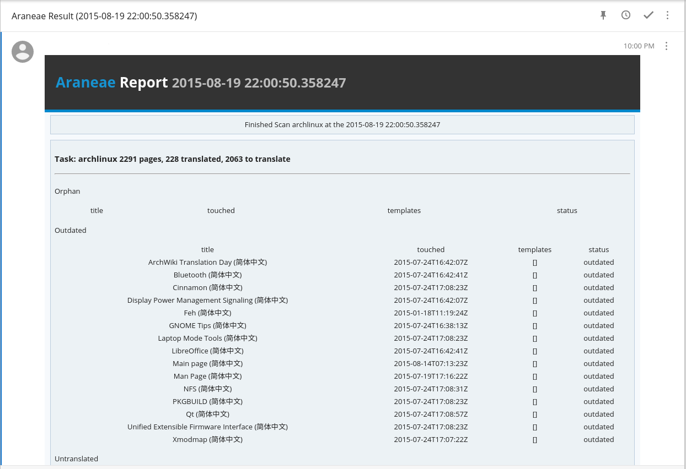

# Araneae

用于汇总 Wiki 翻译情况的 Wiki Bot

## 依赖

需要 python3.4 及以上版本

依赖 `docopt`, `PyYAML`, `requests`, `jinja2` 等库

## 运行

参见配置文件

## 关于翻译进度的评判标准

由于 Archwiki 并没有完整的设置页面的语言属性，目前通过以下方法来判断页面的翻译完成程度

* 比较时间
  1. 首先获取 wiki 所有页面的标题，筛选出其中所有包含 `简体中文` 的部分，同时利用正则匹配出对应的英文版本

  2. 比较两个页面的修改时间，如果中文版本早于英文版，则认为需要更新

  3. 没有对应页面的英文页面视作需要创建

  4. 同时检查对应页面的模板信息，对于 `Translateme`, `Out_of_date` 两个模板给出标注

### 输出 csv 的信息

|链接|页面标题|英文版链接|上次更新时间|英文版更新时间|类型[需要创建，需要更新]

### todo

[ ] 自动添加Out-of-Date Template
[ ] remove the duplicated code

## License

The MIT License (MIT)

Copyright (c) Pandada8 2015

THE SOFTWARE IS PROVIDED "AS IS", WITHOUT WARRANTY OF ANY KIND, EXPRESS OR
IMPLIED, INCLUDING BUT NOT LIMITED TO THE WARRANTIES OF MERCHANTABILITY,
FITNESS FOR A PARTICULAR PURPOSE AND NONINFRINGEMENT. IN NO EVENT SHALL THE
AUTHORS OR COPYRIGHT HOLDERS BE LIABLE FOR ANY CLAIM, DAMAGES OR OTHER
LIABILITY, WHETHER IN AN ACTION OF CONTRACT, TORT OR OTHERWISE, ARISING FROM,
OUT OF OR IN CONNECTION WITH THE SOFTWARE OR THE USE OR OTHER DEALINGS IN
THE SOFTWARE.
